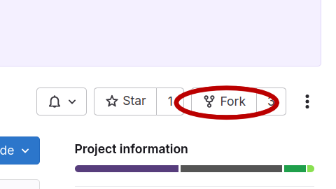

# Labo 2: Programmation en C

*Remarque*: Bien que ce laboratoire porte sur la programmation en C, vous
devriez versionner vos solutions à l'aide de Git et les pousser sur un dépôt
GitLab personnel. Cela vous permettra de pratiquer les commandes Git en
alternance avec la programmation, une habitude essentielle que vous devez
prendre quand vous faites du développement logiciel.

## 1 - Créer une copie (*fork*) d'un dépôt (20 minutes)

Créez une copie d'un dépôt disponible du cours à l'aide du bouton *fork*,
disponible sur l'interface de GitLab. Vous pouvez prendre le dépôt du travail
pratique 1, par exemple, ou celui des laboratoires.



Ensuite, dans les paramètres du projet, rendez le dépôt privé, puis clonez le
dépôt sur votre machine.

Étudiez l'historique du dépôt à l'aide des commandes

* `git gr`: pour voir le graphe de l'historique
* `git show SHA`: pour voir les différences apportées dans le *commit*
  d'identifiant `SHA`
* Est-ce que tous les messages de *commit* respectent la [convention
  recommandée dans le cours](https://chris.beams.io/posts/git-commit/)?

## 2 - Arguments de la fonction `main` (40 minutes)

Écrivez un programme `main.c` qui prend exactement un argument et qui affiche
la longueur de cet argument (en tant que chaîne de caractères) sur la sortie
standard. Votre programme doit retourner `0` lorsque tout s'est déroulé
correctement. Si le nombre d'arguments est incorrect, votre programme doit
afficher un message d'erreur sur la sortie d'erreur (`stderr`) et retourner le
code d'erreur `1`.

Écrivez également un fichier `Makefile` qui vous permet de compiler votre
programme. On s'attend au comportement suivant:

```sh
$ make
gcc -o main main.c
$ ./main alpha
"alpha" est de longueur 5
$ ./main "beta 2"
"beta 2" est de longueur 6
$ echo $?
0
```

Voici un exemple d'utilisation incorrecte:

```sh
$ ./main
erreur: le programme prend exactement un argument
$ ./main 2> /dev/null
$ ./main beta 2
erreur: le programme prend exactement un argument
$ echo $?
1
```

*Rappel*:

* La variable `$?` contient le code d'erreur retournée par la dernière
  commande.
* L'expression `2> /dev/null` redirige la sortie d'erreur vers `/dev/null`, un
  fichier spécial qui supprime toutes les données qui y sont écrites (autrement
  dit, cela permet de faire taire le canal d'erreur)
* Pour calculer la longueur d'une chaîne de caractères, la fonction `strlen` de
  la bibliothèque `string.h` vous sera utile.
* Pour afficher sur la sortie d'erreur, on écrit `fprintf(stderr` au lieu de
  `printf(`.

## 3 - Tableaux et structures (60 minutes)

Dans cet exercice, on s'intéresse à la représentation d'un jeu de 52 cartes et
de certaines mains de 5 cartes qu'on peut former au Poker. Voir la [page
Wikipedia correspondante](https://fr.wikipedia.org/wiki/Main_au_poker) pour la
terminologie (*couleur*, *valeur* ou *rang*, *carré*, *main pleine*, *suite*).

Récupérez le fichier [carte.c](carte.c) et complétez l'implémentation des
fonctions

```c
void afficher_couleur(enum Couleur c);
void afficher_valeur(valeur v);
void afficher_carte(const struct Carte* carte);
void afficher_main5(const struct Main5* main5);
void afficher_cartes(void);
void compter_couleurs(const struct Main5* main5, unsigned int num_cartes[]);
void compter_valeurs(const struct Main5* main5, unsigned int num_cartes[]);
bool est_couleur(const struct Main5* main5);
bool est_carre(const struct Main5* main5);
bool est_main_pleine(const struct Main5* main5);
bool est_suite(const struct Main5* main5);
```

de sorte qu'on ait le comportement suivant:

```c
$ gcc -o carte carte.c
$ ./carte
as de coeur
2 de coeur
3 de coeur
4 de coeur
[...]
valet de pique
dame de pique
roi de pique
mains[0] = (as de carreau,2 de carreau,8 de carreau,valet de carreau,roi de carreau)
Est-ce une suite? non
Est-ce une couleur? oui
Est-ce une main pleine? non
Est-ce un carre? non
mains[1] = (2 de carreau,2 de trefle,8 de coeur,2 de coeur,2 de pique)
Est-ce une suite? non
Est-ce une couleur? non
Est-ce une main pleine? non
Est-ce un carre? oui
mains[2] = (6 de pique,7 de trefle,10 de coeur,9 de pique,8 de carreau)
Est-ce une suite? oui
Est-ce une couleur? non
Est-ce une main pleine? non
Est-ce un carre? non
mains[3] = (roi de pique,9 de trefle,roi de coeur,9 de pique,9 de carreau)
Est-ce une suite? non
Est-ce une couleur? non
Est-ce une main pleine? oui
Est-ce un carre? non
```
